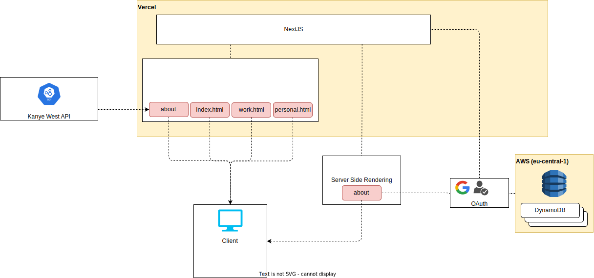

## Overview

## Tech used
* NextJS 12, Next Auth
* React styled with Tailwind
* AWS-sdk, DynamoDB
* GitHub and Google for authentication
* Vercel for deployment
* Jest for testing
* React-json-view for cv.json
* Drawio for UML diagram
* Kanye West REST API for quote of the day

## Getting Started
Just run

`yarn dev`

...and visit local dev server running at [localhost:3000](localhost:3000)

## Deploy on AWS

sam deploy --region eu-central-1 \
    --stack-name about-me-dev  \
    --capabilities CAPABILITY_AUTO_EXPAND \
    --force-upload \
    --no-confirm-changeset \
    --s3-bucket <DEPLOYMENT BUCKET> \
    --s3-prefix  <DEPLOYMENT BUCKET PREFIX> \
    --parameter-overrides "ParameterKey=Environment,ParameterValue=<dev|integration>"